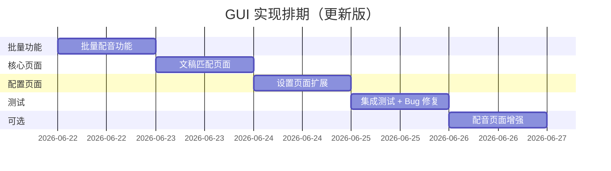

# GUI 界面实现计划

**项目状态**：核心功能 100% 完成，CLI 全部可用，仅缺 GUI 界面  
**预计工作量**：3-5 天  
**技术栈**：PyQt5 + qfluentwidgets（复用现有架构）

---

## 📋 目标清单

### 必做（核心价值）
- [ ] **批量配音功能** - 补齐现有批量处理短板（最高优先级 🔴）
- [ ] **文稿匹配页面** - 最重要的新功能入口
- [ ] **设置页面扩展** - ElevenLabs / 本地 TTS 配置

### 可选（锦上添花）
- [ ] 配音页面增强 - 固定停顿控制
- [ ] 任务创建界面增强 - provider 选择更新

---

## 🎯 实现方案

## 0️⃣ 批量配音功能（优先级：🔴 最高）

### 设计思路
**扩展现有批量处理页面**，添加"批量配音"任务类型，复用现有批量处理架构。

### 技术方案

#### 1. 数据模型扩展
```python
# videocaptioner/core/entities.py
class BatchTaskType(Enum):
    """批量处理任务类型"""
    TRANSCRIBE = "批量转录"
    SUBTITLE = "批量字幕"
    TRANS_SUB = "转录+字幕"
    FULL_PROCESS = "全流程处理"
    DUBBING = "批量配音"  # ← 新增
```

#### 2. 配音任务线程（新建）
```python
# videocaptioner/ui/thread/dubbing_thread.py
from PyQt5.QtCore import QThread, pyqtSignal
from videocaptioner.core.dubbing import DubbingPipeline, DubbingConfig
from videocaptioner.core.asr.asr_data import ASRData

class DubbingThread(QThread):
    """配音任务线程"""
    progress = pyqtSignal(int, str)  # 进度, 消息
    error = pyqtSignal(str)
    finished = pyqtSignal(str)  # 输出文件路径
    
    def __init__(self, subtitle_path: str, config: DubbingConfig, video_path: str = None):
        super().__init__()
        self.subtitle_path = subtitle_path
        self.config = config
        self.video_path = video_path
        self._cancelled = False
    
    def run(self):
        try:
            # 1. 加载字幕
            self.progress.emit(5, "加载字幕文件...")
            asr_data = ASRData.from_subtitle_file(self.subtitle_path)
            
            if self._cancelled:
                return
            
            # 2. 配音合成
            self.progress.emit(10, "初始化配音引擎...")
            pipeline = DubbingPipeline(self.config)
            
            # 3. 执行配音（带进度回调）
            output = pipeline.run(
                asr_data=asr_data,
                video_path=self.video_path,
                progress_callback=self._on_pipeline_progress
            )
            
            if self._cancelled:
                return
            
            self.progress.emit(100, "配音完成")
            self.finished.emit(output)
        
        except Exception as e:
            if not self._cancelled:
                self.error.emit(str(e))
    
    def _on_pipeline_progress(self, current: int, total: int, message: str = ""):
        """配音管线进度回调"""
        # 映射到 10-95% 区间
        percent = 10 + int((current / total) * 85)
        status = message or f"配音中 {current}/{total}"
        self.progress.emit(percent, status)
    
    def cancel(self):
        self._cancelled = True
```

#### 3. 批量处理线程扩展
```python
# videocaptioner/ui/thread/batch_process_thread.py
from videocaptioner.ui.thread.dubbing_thread import DubbingThread

class BatchProcessThread(QThread):
    def _process_task(self, batch_task: BatchTask):
        # ... 现有代码 ...
        elif batch_task.task_type == BatchTaskType.DUBBING:
            self._handle_dubbing_task(batch_task)
    
    def _handle_dubbing_task(self, batch_task: BatchTask):
        """处理配音任务"""
        logger.info(f"开始处理配音任务: {batch_task.file_path}")
        
        # 从工厂创建配音配置
        config = self.factory.create_dubbing_config()
        
        # 检查是否有同名视频文件
        video_path = None
        subtitle_path = Path(batch_task.file_path)
        for ext in ['.mp4', '.mov', '.mkv', '.avi']:
            potential_video = subtitle_path.with_suffix(ext)
            if potential_video.exists():
                video_path = str(potential_video)
                break
        
        thread = DubbingThread(batch_task.file_path, config, video_path)
        batch_task.current_thread = thread
        
        # 保存线程引用
        self.threads.append(thread)
        
        thread.progress.connect(
            partial(self._on_progress_wrapper, batch_task)
        )
        thread.error.connect(
            partial(self._on_error_wrapper, batch_task)
        )
        thread.finished.connect(
            partial(self._on_finished_wrapper, batch_task)
        )
        
        thread.start()
```

#### 4. UI 界面扩展
```python
# videocaptioner/ui/view/batch_process_interface.py
def init_ui(self):
    # 任务类型选择
    self.task_type_combo.addItems([
        str(BatchTaskType.TRANSCRIBE),
        str(BatchTaskType.SUBTITLE),
        str(BatchTaskType.DUBBING),      # ← 新增
        str(BatchTaskType.TRANS_SUB),
        str(BatchTaskType.FULL_PROCESS),
    ])
    
    # 任务类型说明
    self.task_type_descriptions = {
        str(BatchTaskType.TRANSCRIBE): self.tr("仅进行语音识别，生成字幕文件"),
        str(BatchTaskType.SUBTITLE): self.tr("对已有字幕进行分割、优化或翻译"),
        str(BatchTaskType.DUBBING): self.tr("为字幕文件生成配音音轨"),  # ← 新增
        str(BatchTaskType.TRANS_SUB): self.tr("先转录再处理字幕，不合成视频"),
        str(BatchTaskType.FULL_PROCESS): self.tr("转录 → 字幕处理 → 合成视频"),
    }

def filter_files(self, file_paths, task_type: BatchTaskType):
    """根据任务类型过滤有效文件"""
    valid_extensions = 
    
    if task_type in [
        BatchTaskType.TRANSCRIBE,
        BatchTaskType.TRANS_SUB,
        BatchTaskType.FULL_PROCESS,
    ]:
        valid_extensions = {f".{fmt.value}" for fmt in SupportedAudioFormats} | {
            f".{fmt.value}" for fmt in SupportedVideoFormats
        }
    elif task_type in [BatchTaskType.SUBTITLE, BatchTaskType.DUBBING]:  # ← 修改
        valid_extensions = {f".{fmt.value}" for fmt in SupportedSubtitleFormats}
    
    return [
        f for f in file_paths
        if any(f.lower().endswith(ext) for ext in valid_extensions)
    ]
```

#### 5. TaskFactory 扩展
```python
# videocaptioner/ui/task_factory.py
class TaskFactory:
    def create_dubbing_config(self) -> DubbingConfig:
        """从 UI 配置创建 DubbingConfig"""
        from videocaptioner.ui.common.config import cfg
        
        # 读取设置
        provider = cfg.get(cfg.dubbingProvider) or "edge"
        voice = cfg.get(cfg.dubbingVoice) or None
        timing = cfg.get(cfg.dubbingTiming) or "balanced"
        
        config = DubbingConfig(
            provider=provider,
            voice=voice,
            timing=timing,
            adapt_length=cfg.get(cfg.dubbingAdaptLength) or False,
            audio_mode=cfg.get(cfg.dubbingAudioMode) or "replace",
        )
        
        # 固定停顿配置
        if cfg.get("dubbing.fixed_line_pause"):
            config.fixed_line_pause = True
            config.fixed_line_pause_ms = cfg.get("dubbing.fixed_line_pause_ms") or 1000
        
        return config
```

### 界面效果预览

```
┌─────────────────────────────────────────────────────────────┐
│  批量处理                                                    │
├─────────────────────────────────────────────────────────────┤
│  任务类型: [批量配音 ▼]  [添加文件] [清空列表]   [开始处理] │
│                                                              │
│  说明: 为字幕文件生成配音音轨                                │
├───────────────────────────────────────────────────────────────┤
│  文件名              │ 进度                │ 状态           │
├───────────────────────┼─────────────────────┼────────────────┤
│  episode1.srt        │ [████████░░░░] 75%  │ 配音中 15/20   │
│  episode2.srt        │ [░░░░░░░░░░░░] 0%   │ 等待中         │
│  episode3.srt        │ [░░░░░░░░░░░░] 0%   │ 等待中         │
└───────────────────────┴─────────────────────┴────────────────┘
```

### 配音配置面板（可选增强）

在批量处理界面顶部添加配音参数快速配置：

```python
class DubbingConfigCard(QWidget):
    """批量配音快速配置面板"""
    
    def __init__(self, parent=None):
        super().__init__(parent)
        
        layout = QHBoxLayout(self)
        
        # Provider 选择
        self.provider_combo = ComboBox()
        self.provider_combo.addItems([
            "Edge TTS (免费)",
            "ElevenLabs",
            "Gemini",
            "SiliconFlow",
            "OpenAI",
            "Dots-TTS (本地)",
            "VoxCPM (本地)"
        ])
        
        # Voice 输入
        self.voice_edit = LineEdit()
        self.voice_edit.setPlaceholderText("音色名称（可选）")
        
        # Timing 选择
        self.timing_combo = ComboBox()
        self.timing_combo.addItems(["balanced", "strict", "natural", "none"])
        
        layout.addWidget(QLabel("配音引擎:"))
        layout.addWidget(self.provider_combo)
        layout.addWidget(QLabel("音色:"))
        layout.addWidget(self.voice_edit)
        layout.addWidget(QLabel("时间策略:"))
        layout.addWidget(self.timing_combo)
```

### 工作量估算
- 数据模型扩展：**0.5 小时**
- DubbingThread 实现：**2 小时**
- BatchProcessThread 扩展：**1 小时**
- UI 界面适配：**1 小时**
- TaskFactory 扩展：**0.5 小时**
- 测试 + 调试：**2 小时**
- **总计：1 天**

### 验收标准
- [ ] 能拖拽 10 个 SRT 文件到批量处理界面
- [ ] 选择"批量配音"任务类型
- [ ] 每个文件独立进度条显示
- [ ] 配音完成后自动保存（`input.srt` → `input.dubbed.mp3`）
- [ ] 如果有同名视频，自动合成配音视频
- [ ] 支持取消任务
- [ ] 错误提示清晰（API Key 失效、网络错误等）

---

## 1️⃣ 文稿匹配页面（优先级：🟡 高）

### 文件路径
`videocaptioner/ui/view/text_matching_interface.py`

### 设计思路
**复用现有布局模式**，参考 `transcription_interface.py` 的左右分栏结构：
- **左侧**：输入区（视频/音频 + ASR 设置 + 执行按钮）
- **右侧**：文稿输入区（多行文本框 + 导入按钮）
- **底部**：进度条 + 状态提示

### 界面布局（ASCII 预览）
```
┌─────────────────────────────────────────────────────────────┐
│  文稿匹配  [?]                                              │
├──────────────────────────┬──────────────────────────────────┤
│  媒体输入                │  正确文稿                        │
│  ┌────────────────────┐  │  ┌────────────────────────────┐ │
│  │  [拖拽视频/音频]  │  │  │  在这里粘贴正确的文稿...   │ │
│  │  或点击选择文件    │  │  │                            │ │
│  └────────────────────┘  │  │  (支持中英文，自动检测语言)│ │
│                          │  │                            │ │
│  ASR 引擎                │  │                            │ │
│  ☑ Faster Whisper  [▼]  │  │                            │ │
│                          │  │                            │ │
│  语言                    │  │                            │ │
│  ○ 自动检测  ○ 中文      │  │                            │ │
│  ○ English               │  └────────────────────────────┘ │
│                          │  [📄 导入 TXT]  [📋 清空]       │
│  最大字符/行             │  字数统计: 1234 字符            │
│  [32      ▲▼]           │                                  │
│                          │                                  │
│  ┌──────────────────┐    │                                  │
│  │  [▶ 开始匹配]    │    │                                  │
│  └──────────────────┘    │                                  │
│                          │                                  │
│  ⏸  已暂停                │                                  │
│  [████████░░░░] 75%      │                                  │
│  正在对齐文本...         │                                  │
└──────────────────────────┴──────────────────────────────────┘
```

### 关键组件

#### 1. 媒体输入卡片（复用）
```python
from videocaptioner.ui.components import MediaInputCard

self.media_input = MediaInputCard(
    title="视频/音频文件",
    accept_formats=[".mp4", ".mov", ".mp3", ".wav", ".m4a"]
)
```

#### 2. ASR 设置卡片（复用）
```python
from videocaptioner.ui.view.transcription_interface import ASRSettingCard

self.asr_setting = ASRSettingCard(
    default_engine="faster_whisper",
    show_advanced=False  # 简化模式，只显示引擎选择
)
```

#### 3. 文稿输入组件（新建）
```python
from qfluentwidgets import PlainTextEdit, PushButton, ToolButton
from qfluentwidgets import FluentIcon as FIF

class TranscriptInputCard(QWidget):
    """正确文稿输入区域"""
    
    def __init__(self, parent=None):
        super().__init__(parent)
        self.text_edit = PlainTextEdit()
        self.text_edit.setPlaceholderText("粘贴或输入正确的文稿文本...\n\n支持中英文混合")
        
        self.import_btn = PushButton(FIF.DOCUMENT, "导入 TXT")
        self.clear_btn = ToolButton(FIF.DELETE)
        self.char_count = QLabel("0 字符")
        
        self.text_edit.textChanged.connect(self._update_char_count)
        self.import_btn.clicked.connect(self._import_file)
        self.clear_btn.clicked.connect(self.text_edit.clear)
    
    def _import_file(self):
        path, _ = QFileDialog.getOpenFileName(
            self, "选择文本文件", "", "文本文件 (*.txt *.md);;所有文件 (*.*)"
        )
        if path:
            with open(path, 'r', encoding='utf-8') as f:
                self.text_edit.setPlainText(f.read())
    
    def _update_char_count(self):
        count = len(self.text_edit.toPlainText())
        self.char_count.setText(f"{count} 字符")
    
    def get_text(self) -> str:
        return self.text_edit.toPlainText().strip()
```

#### 4. 执行按钮与进度显示（复用模式）
```python
from qfluentwidgets import PrimaryPushButton, ProgressBar, StateToolTip

class TextMatchingInterface(QWidget):
    def __init__(self, parent=None):
        super().__init__(parent)
        self.start_btn = PrimaryPushButton("开始匹配")
        self.progress_bar = ProgressBar()
        self.status_label = QLabel()
        
        self.worker = None  # QThread worker
        self.start_btn.clicked.connect(self._start_matching)
    
    def _start_matching(self):
        # 参数校验
        media_path = self.media_input.get_file_path()
        if not media_path:
            self._show_error("请选择媒体文件")
            return
        
        user_text = self.transcript_input.get_text()
        if not user_text:
            self._show_error("请输入正确文稿")
            return
        
        # 启动后台任务
        self.worker = TextMatchingWorker(
            media_path=media_path,
            user_text=user_text,
            asr_engine=self.asr_setting.get_engine(),
            max_chars=self.max_chars_spinbox.value()
        )
        self.worker.progress.connect(self._update_progress)
        self.worker.finished.connect(self._on_finished)
        self.worker.error.connect(self._on_error)
        self.worker.start()
        
        self.start_btn.setEnabled(False)
        self.progress_bar.setValue(0)
```

#### 5. 后台任务线程（新建）
```python
from PyQt5.QtCore import QThread, pyqtSignal
from videocaptioner.core.alignment import TextMatchingTask

class TextMatchingWorker(QThread):
    progress = pyqtSignal(int)  # 0-100
    finished = pyqtSignal(str)  # 输出文件路径
    error = pyqtSignal(str)
    
    def __init__(self, media_path, user_text, asr_engine, max_chars):
        super().__init__()
        self.media_path = media_path
        self.user_text = user_text
        self.asr_engine = asr_engine
        self.max_chars = max_chars
    
    def run(self):
        try:
            from videocaptioner.core.asr import transcribe
            from videocaptioner.core.alignment import align_text_to_asr
            from videocaptioner.core.asr.asr_data import ASRData
            
            # 1. ASR 识别（0-70%）
            self.progress.emit(10)
            asr_result = transcribe(
                self.media_path,
                engine=self.asr_engine,
                # TODO: 传递进度回调
            )
            self.progress.emit(70)
            
            # 2. DTW 对齐（70-90%）
            aligned = align_text_to_asr(
                asr_result,
                self.user_text,
                max_chars_per_line=self.max_chars
            )
            self.progress.emit(90)
            
            # 3. 保存文件（90-100%）
            output_path = Path(self.media_path).with_suffix('.aligned.srt')
            aligned.to_srt_file(str(output_path))
            self.progress.emit(100)
            
            self.finished.emit(str(output_path))
        
        except Exception as e:
            self.error.emit(str(e))
```

### 菜单注册
```python
# 在 videocaptioner/ui/view/main_window.py 中添加

from .text_matching_interface import TextMatchingInterface

class MainWindow(FluentWindow):
    def __init__(self):
        super().__init__()
        # ... 现有代码 ...
        
        # 在 "转录" 和 "字幕" 之间插入
        self.textMatchingInterface = TextMatchingInterface(self)
        self.addSubInterface(
            self.textMatchingInterface,
            FIF.ALIGNMENT,  # 或 FIF.SYNC
            "文稿匹配",
            NavigationItemPosition.TOP
        )
```

### 工作量估算
- 界面布局 + 组件组装：**3-4 小时**
- 后台任务线程实现：**2-3 小时**
- 测试 + 细节调整：**2 小时**
- **总计：1 天**

---

## 2️⃣ 设置页面扩展（优先级：🟡 中）

### 文件路径
扩展 `videocaptioner/ui/view/setting_interface.py`

### 新增设置卡片

#### A. ElevenLabs TTS 设置
```python
class ElevenLabsSettingCard(ExpandGroupSettingCard):
    """ElevenLabs TTS 配置卡片"""
    
    def __init__(self, parent=None):
        super().__init__(FIF.MICROPHONE, "ElevenLabs TTS", "高质量多语言配音", parent)
        
        # API Keys（支持多个）
        self.api_key_edit = LineEdit()
        self.api_key_edit.setPlaceholderText("输入 API Key（多个用逗号分隔）")
        self.api_key_edit.textChanged.connect(self._save_keys)
        
        # Voice 选择
        self.voice_combo = ComboBox()
        self.voice_combo.addItems([
            "Rachel (英文-女)",
            "Drew (英文-男)",
            "Clyde (英文-男)",
            # ... 从 presets.ELEVENLABS_PREMADE_VOICES 加载
        ])
        
        # 高级参数
        self.stability_slider = Slider(Qt.Horizontal)
        self.stability_slider.setRange(0, 100)
        self.stability_slider.setValue(50)
        
        self.similarity_slider = Slider(Qt.Horizontal)
        self.similarity_slider.setRange(0, 100)
        self.similarity_slider.setValue(75)
        
        # 布局
        self.addWidget(QLabel("API Keys"), self.api_key_edit)
        self.addWidget(QLabel("默认音色"), self.voice_combo)
        self.addWidget(QLabel("稳定性 (Stability)"), self.stability_slider)
        self.addWidget(QLabel("相似度 (Similarity Boost)"), self.similarity_slider)
    
    def _save_keys(self):
        keys = self.api_key_edit.text()
        cfg.set("tts.elevenlabs.api_keys", keys)
```

#### B. 本地 TTS 设置
```python
class LocalTTSSettingCard(ExpandGroupSettingCard):
    """Dots-TTS / VoxCPM 本地服务配置"""
    
    def __init__(self, parent=None):
        super().__init__(FIF.DOWNLOAD, "本地 TTS 服务", "Dots-TTS 和 VoxCPM 配置", parent)
        
        # Dots-TTS
        self.dots_enabled = SwitchButton()
        self.dots_url = LineEdit()
        self.dots_url.setText("http://127.0.0.1:7860")
        self.dots_start_script = PushSettingCard(
            "选择启动脚本",
            FIF.FOLDER,
            "Dots 启动脚本",
            "用于自动启动服务"
        )
        
        # VoxCPM
        self.voxcpm_enabled = SwitchButton()
        self.voxcpm_url = LineEdit()
        self.voxcpm_url.setText("http://127.0.0.1:9880")
        
        # 服务状态监控
        self.status_label = QLabel("⚪ 未连接")
        self.test_btn = PushButton("测试连接")
        self.test_btn.clicked.connect(self._test_services)
        
        # 布局
        self.addWidget(QLabel("Dots-TTS"), self.dots_enabled)
        self.addWidget(QLabel("服务地址"), self.dots_url)
        self.addSettingCard(self.dots_start_script)
        
        self.addWidget(QLabel("VoxCPM"), self.voxcpm_enabled)
        self.addWidget(QLabel("服务地址"), self.voxcpm_url)
        
        self.addWidget(self.status_label, self.test_btn)
    
    def _test_services(self):
        """测试服务可用性"""
        from urllib.request import urlopen
        
        results = []
        for name, url in [("Dots", self.dots_url.text()), 
                          ("VoxCPM", self.voxcpm_url.text())]:
            try:
                urlopen(url, timeout=2)
                results.append(f"✅ {name}")
            except:
                results.append(f"❌ {name}")
        
        self.status_label.setText(" | ".join(results))
```

#### C. 固定停顿设置（配音增强）
```python
class DubbingEnhancementCard(ExpandGroupSettingCard):
    """配音增强功能"""
    
    def __init__(self, parent=None):
        super().__init__(FIF.PAUSE, "配音增强", "行间停顿控制", parent)
        
        self.fixed_pause_switch = SwitchButton()
        self.fixed_pause_switch.setChecked(False)
        
        self.pause_duration = ComboBox()
        self.pause_duration.addItems(["500ms", "1000ms", "1500ms", "2000ms"])
        self.pause_duration.setCurrentIndex(1)  # 默认 1000ms
        
        self.addWidget(
            QLabel("启用固定停顿"),
            self.fixed_pause_switch
        )
        self.addWidget(
            QLabel("停顿时长"),
            self.pause_duration
        )
        
        # 说明标签
        tip = QLabel("⚠️ 启用后将忽略原视频时间轴，按顺序拼接配音")
        tip.setStyleSheet("color: #888; font-size: 12px;")
        self.addWidget(tip)
```

### 集成到设置页面
```python
# 在 setting_interface.py 的 __init__ 中添加

class SettingInterface(ScrollArea):
    def __init__(self, parent=None):
        super().__init__(parent)
        # ... 现有代码 ...
        
        # TTS 配置组
        self.tts_group = SettingCardGroup("TTS 配音", self.scrollWidget)
        self.elevenlabs_card = ElevenLabsSettingCard(self.tts_group)
        self.local_tts_card = LocalTTSSettingCard(self.tts_group)
        self.dubbing_enhance_card = DubbingEnhancementCard(self.tts_group)
        
        self.tts_group.addSettingCard(self.elevenlabs_card)
        self.tts_group.addSettingCard(self.local_tts_card)
        self.tts_group.addSettingCard(self.dubbing_enhance_card)
```

### 工作量估算
- ElevenLabs 设置卡片：**2 小时**
- 本地 TTS 设置卡片：**2 小时**
- 固定停顿设置：**1 小时**
- 测试 + 配置持久化：**1 小时**
- **总计：0.75 天**

---

## 3️⃣ 配音页面增强（优先级：🟢 低）

### 文件路径
扩展现有的配音相关界面（如果有单独的 dubbing_interface.py）

### 新增功能
- Provider 选择下拉框更新（添加 elevenlabs、dots、voxcpm、openai）
- 固定停顿开关（同步设置页面的配置）
- 实时状态提示（显示当前使用的 API Key 索引）

### 工作量估算
- **0.5 天**（如果不存在独立配音页面，可跳过）

---

## 📦 依赖检查

### 现有依赖（已安装）
```toml
PyQt5 = "^5.15.0"
qfluentwidgets = "^1.1.0"
```

### 无需新增依赖
所有功能复用现有 UI 框架。

---

## 🧪 测试计划

### 手动测试清单

#### 文稿匹配页面
- [ ] 拖拽视频文件正常
- [ ] 导入 TXT 文稿正常
- [ ] 字数统计实时更新
- [ ] 开始匹配后进度条流畅更新
- [ ] 任务完成后弹出保存路径
- [ ] 取消任务后线程正常清理

#### 设置页面
- [ ] ElevenLabs API Keys 保存成功
- [ ] 本地 TTS 服务测试连接正常
- [ ] 固定停顿设置保存后，配音任务能读取

#### 跨页面联动
- [ ] 设置页面的配置能在任务创建时生效
- [ ] 文稿匹配生成的 SRT 能导入到翻译/配音流程

---

## 📅 开发排期

### 推荐执行顺序



### 里程碑

| 日期 | 里程碑 | 可交付 |
|------|--------|--------|
| **D1** | 批量配音功能完成 | 用户能批量处理字幕配音 |
| **D2** | 文稿匹配页面完成 | 用户能通过 GUI 使用 DTW 功能 |
| **D3** | 设置页面完成 | 用户能配置所有新增 TTS 引擎 |
| **D4** | 测试通过 | 完整 GUI 功能可用 |

---

## 🚀 快速启动

### 如果现在就想开始：

```bash
# 1. 激活环境
cd "D:\音视频综合助手"
.venv\Scripts\activate

# 2. 确认 PyQt5 已安装（GUI 必需）
pip install PyQt5 qfluentwidgets

# 3. 创建新文件
touch videocaptioner/ui/view/text_matching_interface.py

# 4. 复制现有页面作为模板
cp videocaptioner/ui/view/transcription_interface.py \
   videocaptioner/ui/view/text_matching_interface.py

# 5. 开始开发...
```

### 开发模式启动
```bash
python -m videocaptioner.ui.main
# 或
videocaptioner gui
```

---

## ⚠️ 注意事项

### 架构约束
1. **数据流**：UI 层只负责展示和参数收集，所有业务逻辑调用 `core/` 模块
2. **配置管理**：使用现有的 `ui/common/config.py`，不要重复造轮子
3. **信号总线**：跨页面通信使用 `ui/common/signal_bus.py`

### 已知坑
- ⚠️ PyQt5 的 QThread 必须在主线程中创建
- ⚠️ 长时间任务（ASR）必须用 QThread，否则 GUI 卡死
- ⚠️ 进度回调需要用 `pyqtSignal`，不能直接调用 UI 更新

### 代码规范
- 遵循现有命名：`*Interface` 是页面，`*Card` 是卡片组件
- 复用 qfluentwidgets 的组件，保持风格一致
- 所有文本使用中文（与现有 UI 一致）

---

## 📚 参考文件

### 必读（作为模板）
```
videocaptioner/ui/view/
├── transcription_interface.py     # 布局参考（左右分栏）
├── setting_interface.py           # 设置卡片参考
└── task_creation_interface.py     # 任务线程参考

videocaptioner/ui/components/
├── FasterWhisperSettingWidget.py  # 下载逻辑参考
└── transcription_setting_card.py  # 自定义卡片参考
```

### 业务逻辑对接
```
videocaptioner/core/
├── alignment/
│   ├── text_matcher.py            # TextMatchingTask 类
│   └── __init__.py                # align_text_to_asr 函数
├── speech/
│   └── providers.py               # 所有 TTS provider
└── dubbing/
    └── models.py                  # DubbingConfig.fixed_line_pause
```

---

## ✅ 验收标准

### 最低可交付版本（MVP）
- ✅ 文稿匹配页面能正常运行（输入 → 执行 → 输出）
- ✅ 设置页面能保存配置（配置能被 CLI/任务读取）
- ✅ 无崩溃、无阻塞主线程的 bug

### 完整版
- ✅ 所有 UI 元素响应流畅
- ✅ 错误提示友好清晰
- ✅ 进度显示准确
- ✅ 配置持久化正常

---

## 🎉 总结

### 工作量预估
- **批量配音功能**：1 天
- **最小化版本（批量配音 + 文稿匹配页面）**：2-2.5 天
- **完整版（+ 设置页面）**：3-4 天
- **豪华版（+ 配音增强）**：4-6 天

### 技术难度
- 🟢 **简单**：设置页面扩展（纯配置项）
- 🟡 **中等**：文稿匹配页面（涉及线程 + 进度回调）
- 🔴 **困难**：无（所有核心逻辑已完成）

### 建议策略
**先做文稿匹配页面**，这是最大的新功能价值点。设置页面可以后补，甚至暂时让用户通过 CLI 配置也行：
```bash
videocaptioner config set tts.elevenlabs.api_keys "key1,key2"
videocaptioner config set dubbing.fixed_line_pause true
```

需要我直接开始实现文稿匹配页面吗？
