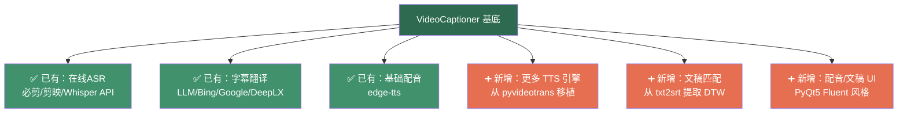

# 字幕集成软件方案分析

## 三个项目对比总览

| 维度 | pyvideotrans | VideoCaptioner | txt2srt |
|------|-------------|----------------|---------|
| **代码规模** | ~30,000-40,000 行 / ~280 文件 | ~15,000-18,000 行 / ~80 文件 | ~2,300 行 / 6 文件 |
| **UI 框架** | PySide6 + QDarkStyle | PyQt5 + PyQt-Fluent-Widgets | Gradio / Tkinter |
| **架构质量** | 功能强大但臃肿，全局变量混乱 | 三层架构、清晰解耦、设计模式良好 | 简单扁平，原型级别 |
| **依赖量** | ~250 个依赖（含 PyTorch CUDA） | ~20 个核心依赖 | ~10 个依赖 |
| **STT 引擎** | 22 个（本地+云端） | 5 个（含必剪、剪映在线通道） | Whisper（仅用于对齐） |
| **翻译引擎** | 24 个 | 4 个（含 LLM 智能翻译） | 无 |
| **TTS/配音** | 33 个（含语音克隆） | 有基础框架（edge-tts） | 无 |
| **文稿匹配** | 有（`textmatching.py`，622行） | 无 | 核心功能（DTW 对齐） |
| **模块化程度** | 提供者模式清晰，但核心管线耦合严重 | ⭐ 核心层完全独立于 UI | 函数可提取 |
| **Python 版本** | ≥3.10, <3.11（极严格） | ≥3.10, <3.13 | 无限制 |

---

## 方案一：以 pyvideotrans 为基础

### 做法
从 pyvideotrans 中独立出字幕翻译和配音功能，并将 VideoCaptioner 的在线 ASR 通道（必剪、剪映）移植进来。

### 优势
- 拥有 **33 个 TTS 引擎** 和 **24 个翻译引擎**，功能最全
- 已有文稿匹配功能（`textmatching.py`）
- 提供者注册机制（`ChannelProvider` + `get_class()`）方便扩展

### 劣势与风险
> [!CAUTION]
> **难度极高，不推荐作为首选方案**

- **"God Class" 问题**：核心管线 `TransCreate` 达 1,619 行 / 78KB，所有功能（音频提取、降噪、识别、翻译、配音、速度对齐、视频合成）全部耦合在一个类中。要"独立出"任何子功能，需要深入理解并拆解这个巨型类
- **全局状态严重**：`config.py` 有 948 行 / ~200+ 全局设置项，到处被引用。作者自嘲："*全局变量乱如麻，if分支叠成塔*"
- **依赖地狱**：~250 个依赖包，含 PyTorch CUDA 12.8、pyannote-audio 等重型依赖。Python 版本被锁定在 3.10-3.11
- **UI 强耦合**：`winform/` 目录有 ~62 个设置对话框文件，每个提供者都有配套的 UI 表单
- **移植在线 ASR 相对简单**：必剪和剪映的 ASR 实现（~200-333 行）结构清晰，可以移植，但需要适配 pyvideotrans 的 `BaseRecogn` 接口和全局配置系统

### 工作量估计
- 理解和拆解 `TransCreate`：**5-8 天**
- 处理全局状态依赖：**3-5 天**
- 移植在线 ASR：**2-3 天**
- 精简依赖和测试：**3-5 天**
- **总计：约 15-25 天**

---

## 方案二：以 VideoCaptioner 为基底 ⭐ 推荐

### 做法
在 VideoCaptioner 的基础上，加入配音服务（从 pyvideotrans 移植 TTS 引擎）和文稿匹配功能（从 txt2srt 提取 DTW 对齐算法）。

### 优势

> [!TIP]
> **架构优势决定了这是最佳方案**

- **三层架构清晰**：`core/`（纯业务逻辑）→ `cli/`（命令行）→ `ui/`（GUI），核心层零 UI 依赖
- **已有扩展点**：
  - ASR：`BaseASR` 策略模式 + `ChunkedASR` 分块处理装饰器 — 已有 5 个引擎
  - 翻译：`BaseTranslator` 策略模式 + `TranslatorFactory` 工厂 — 已有 4 个引擎
  - TTS/配音：**已有基础框架**（`core/dubbing/`、`core/tts/`、`core/speech/`），含 `edge-tts` 支持
- **代码质量高**：类型标注完整、设计模式运用得当（策略、工厂、模板方法、装饰器）、有测试套件
- **依赖轻量**：核心约 20 个依赖，无 PyTorch 硬性依赖
- **在线 ASR 已就绪**：必剪和剪映通道已内置

### 需要做的工作

#### 1. 添加更多 TTS/配音引擎（从 pyvideotrans 移植）
- pyvideotrans 的 TTS 提供者遵循 `BaseTTS` 模式，每个引擎一个文件
- VideoCaptioner 已有 `core/tts/` 和 `core/dubbing/` 目录
- **需要移植的核心引擎**（按优先级）：
  - `edge-tts` — ✅ 已有
  - OpenAI TTS、Azure TTS — 云端，~100-200 行/个
  - GPT-SoVITS、CosyVoice — 本地 API，~150-250 行/个
  - 其他按需添加
- **关键挑战**：pyvideotrans 的速度对齐模块（`_rate.py`，40KB）比较复杂，需要适配或简化

#### 2. 添加文稿匹配功能（从 txt2srt 提取）
- txt2srt 的核心对齐逻辑仅 ~400 行纯 Python + `dtw-python` + `numpy`
- 输入接口简洁：`recognized_segments: List[Dict]` + `user_sentences: List[str]`
- 可直接作为 `core/` 下的新模块，例如 `core/alignment/`
- 外部依赖仅增加 `dtw-python`（轻量）
- VideoCaptioner 已有 ASR 能力，可以直接提供 `recognized_segments`

#### 3. UI 适配
- VideoCaptioner 使用 PyQt5 + Fluent Widgets，美观度好
- 需要新增配音设置界面和文稿匹配界面
- 可参考现有的 `view/` 和 `components/` 模式

### 工作量估计
- 移植 3-5 个核心 TTS 引擎：**3-5 天**
- 集成音频速度对齐：**2-3 天**
- 提取并集成文稿匹配：**1-2 天**
- UI 界面开发：**3-5 天**
- 测试和调试：**2-3 天**
- **总计：约 12-18 天**

---

## 方案三（补充）：混合方案

> [!NOTE]
> 不建议从零开始，因为 VideoCaptioner 的架构已经非常适合作为基底

如果您希望更灵活，还可以考虑：
- 以 VideoCaptioner 为基底（方案二）
- **不是移植 pyvideotrans 的 TTS 代码**，而是让 VideoCaptioner 通过 API 调用本地运行的 GPT-SoVITS / CosyVoice 等 TTS 服务
- 这样 TTS 引擎的复杂度完全在外部，VideoCaptioner 只需实现一个轻量的 API 客户端

这进一步降低了集成难度，但要求用户自行部署 TTS 服务。

---

## 最终推荐

> [!IMPORTANT]
> **强烈推荐方案二：以 VideoCaptioner 为基底**
> 
> 核心理由：
> 1. **架构质量**：三层解耦架构远优于 pyvideotrans 的全局变量和 God Class
> 2. **工作量更少**：约 12-18 天 vs 15-25 天
> 3. **风险更低**：在清晰架构上添加功能 vs 在混乱架构中拆解功能
> 4. **可维护性**：未来添加新功能更容易
> 5. **依赖更轻**：不需要拖入 PyTorch CUDA 等重型依赖

方案一的本质是"做减法"（从臃肿系统中剥离），方案二的本质是"做加法"（向清晰架构中添加）。在软件工程中，**在好架构上做加法永远比在差架构上做减法容易**。
