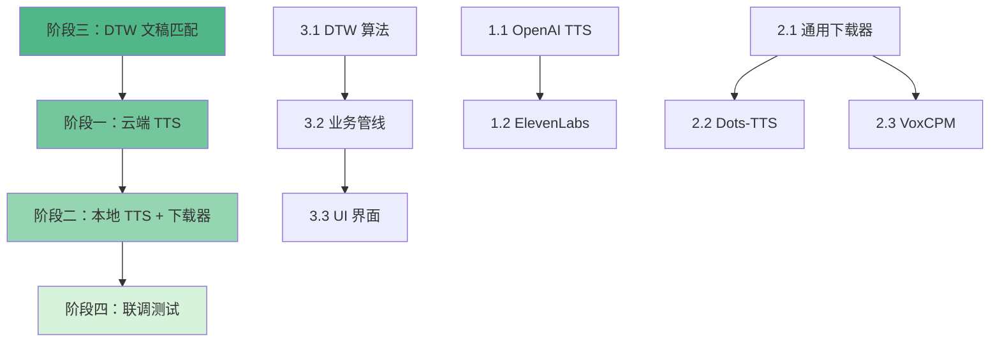

# 字幕与配音集成软件实现计划（优化版）
**基于 VideoCaptioner 架构 | 版本 2.0**

---

## 📋 执行摘要

本计划在 VideoCaptioner 现有三层架构基础上，通过模块化移植实现：
1. **云端+本地 TTS 引擎集成**（从 pyvideotrans 精选移植）
2. **文稿-时间戳对齐功能**（从 txt2srt 提取 DTW 算法）
3. **延迟下载机制**（复用 Faster Whisper 模式）

**预计工作量**：12-18 个工作日  
**推荐执行顺序**：阶段三 → 阶段一 → 阶段二 → 阶段四

---

## 🎯 总体架构设计

### 核心原则
- **零破坏性修改**：不改动 VideoCaptioner 现有核心逻辑
- **策略模式复用**：所有新增引擎遵循现有 `BaseTTS` 接口
- **UI 解耦**：业务逻辑在 `core/`，UI 配置在 `ui/view/`
- **依赖最小化**：避免引入 PyTorch、CUDA 等重型依赖

### 新增目录结构
```
VideoCaptioner-src/
├── core/
│   ├── tts/
│   │   ├── openai_tts.py        # ✅ 已存在，需完善
│   │   ├── elevenlabs_tts.py    # 新增
│   │   ├── dots_tts.py          # 新增（本地 Gradio 服务）
│   │   └── voxcpm_tts.py        # 新增（支持音色克隆）
│   ├── alignment/               # 新增目录
│   │   ├── __init__.py
│   │   ├── dtw_aligner.py       # DTW 核心算法
│   │   └── text_matcher.py      # 业务管线适配器
│   └── utils/
│       └── model_downloader.py  # 通用延迟下载工具类
├── ui/view/
│   ├── tts_settings_card.py     # 扩展现有 TTS 设置
│   └── text_matching_page.py    # 新增文稿匹配页面
└── tests/
    ├── test_tts_engines.py      # TTS 引擎单元测试
    └── test_alignment.py        # DTW 算法测试
```

---

## 📌 阶段一：云端 TTS 渠道移植

### 优先级：🟡 中（建议在阶段三后执行）
### 预计工作量：3-5 天

### 1.1 OpenAI TTS 完善（已有基础代码）
**文件位置**：`core/tts/openai_tts.py`

**检查清单**：
- [ ] 验证 `BaseTTS` 接口实现完整性
- [ ] 支持 `tts-1` 和 `tts-1-hd` 模型选择
- [ ] 支持全部 6 种音色（alloy, echo, fable, onyx, nova, shimmer）
- [ ] 实现流式输出（chunked transfer）以加速长文本
- [ ] 添加速率限制处理（Rate Limit Retry）
- [ ] 实现音频格式选择（mp3/opus/aac/flac）

**UI 需求**：
- 在现有 TTS 设置卡片中添加 OpenAI 选项
- API Key 输入框（支持环境变量 `OPENAI_API_KEY`）
- 模型选择下拉框
- 音色选择下拉框（带预览功能）

**参考源码**：`pyvideotrans/tts/_openaitts.py`（约 150 行）

---

### 1.2 ElevenLabs TTS 移植
**新建文件**：`core/tts/elevenlabs_tts.py`

**核心功能**：
```python
class ElevenLabsTTS(BaseTTS):
    """
    ElevenLabs Text-to-Speech 引擎
    支持：多语言、高质量音色、情感控制
    """
    def __init__(self, api_key: str, model: str = "eleven_multilingual_v2"):
        self.api_key = api_key
        self.model = model
        self.base_url = "https://api.elevenlabs.io/v1"
    
    def _synthesize(self, text: str, voice_id: str, **kwargs) -> bytes:
        # 调用 ElevenLabs API
        # 处理分段合成（超过 5000 字符）
        # 返回音频二进制数据
        pass
```

**实现要点**：
- 支持 Voice ID 选择（预置常用音色列表）
- 实现文本分段（API 限制 5000 字符/请求）
- 支持 `stability` 和 `similarity_boost` 参数调节
- 错误处理：配额超限、无效 Voice ID

**UI 需求**：
- API Key 输入
- Voice ID 选择（下拉框 + 自定义输入）
- 高级设置：Stability、Similarity Boost 滑块

**参考源码**：`pyvideotrans/tts/_elevenlabs.py`（约 200 行）

**工作量**：1.5-2 天

---

## 📌 阶段二：本地 TTS 渠道与延迟下载机制

### 优先级：🔴 低（架构最复杂，建议最后做）
### 预计工作量：4-6 天

> **设计模式思路**：复用 VideoCaptioner `FasterWhisperSettingWidget` 的逻辑。通过在配置文件中保留本地服务的安装路径，当用户选择该 TTS 且路径下无程序时，触发下载窗口。

### 2.1 通用模型下载器抽象
**新建文件**：`core/utils/model_downloader.py`

**功能设计**：
```python
class ModelDownloader:
    """
    通用模型/环境下载器（复用 Faster Whisper 逻辑）
    支持：进度条、断点续传、SHA256 校验
    """
    def __init__(self, model_name: str, download_url: str, target_dir: Path):
        pass
    
    def download(self, progress_callback: Callable[[int, int], None]):
        # 下载逻辑
        pass
    
    def verify_integrity(self) -> bool:
        # 校验文件完整性
        pass
    
    def extract(self):
        # 解压 zip/tar.gz
        pass
```

**关键特性**：
- 支持多线程下载（提升速度）
- 集成 `requests` 的 `stream=True` 模式
- UI 进度回调接口

**工作量**：1 天

---

### 2.2 Dots-TTS 移植与按需下载
**新建文件**：`core/tts/dots_tts.py`

**架构设计**：
```python
class DotsTTS(BaseTTS):
    """
    Dots-TTS 本地 Gradio 服务适配器
    依赖：本地 Python 环境 + Gradio 服务
    """
    def __init__(self, service_dir: Path, port: int = 7860):
        self.service_dir = service_dir
        self.port = port
        self.process = None  # 服务进程句柄
    
    def _ensure_service_running(self):
        # 检查端口是否监听
        # 未运行则启动 `python app.py`
        pass
    
    def _synthesize(self, text: str, **kwargs) -> bytes:
        self._ensure_service_running()
        # POST 请求到 http://localhost:7860/api/generate
        pass
    
    def __del__(self):
        # 清理进程
        if self.process:
            self.process.terminate()
```

**实现难点**：
1. **服务生命周期管理**：
   - 启动时检测端口占用（避免冲突）
   - 使用 `subprocess.Popen` 启动服务
   - 退出时优雅终止进程

2. **环境依赖检查**：
   - 检测 Python 环境（需要独立虚拟环境）
   - 验证依赖包是否安装（`requirements.txt`）

**UI 设计**：
- **设置卡片**：
  - Dots-TTS 安装路径选择
  - 【下载环境包】按钮（未检测到时显示）
  - 服务状态指示灯（运行中/已停止）
- **下载弹窗**：
  - 复用 `FasterWhisperSettingWidget` 的下载逻辑
  - 下载 URL：指向预打包的 Dots-TTS 环境包（zip）
  - 解压到用户指定目录

**参考源码**：
- `pyvideotrans/tts/_dotstts.py`（约 180 行）
- `VideoCaptioner/ui/components/faster_whisper_setting_widget.py`（下载逻辑）

**工作量**：2-2.5 天

---

### 2.3 VoxCPMv2 移植与音色克隆
**新建文件**：`core/tts/voxcpm_tts.py`

**核心功能**：
```python
class VoxCPMTTS(BaseTTS):
    """
    VoxCPM v2 TTS 引擎
    特性：零样本音色克隆（Few-shot Voice Cloning）
    """
    def __init__(self, service_url: str = "http://127.0.0.1:9880"):
        self.service_url = service_url
    
    def _synthesize(
        self, 
        text: str, 
        ref_audio: Optional[Path] = None,  # 参考音频
        dit_steps: int = 10,
        **kwargs
    ) -> bytes:
        payload = {
            "text": text,
            "ref_wav": str(ref_audio) if ref_audio else None,
            "dit_steps": dit_steps,
            "temperature": kwargs.get("temperature", 1.0)
        }
        # POST /generate
        pass
```

**音色克隆适配**：
- VideoCaptioner 的 `ASRDataSeg` 已有 `clone_audio_path` 字段
- 在 UI 中允许用户上传参考音频（3-10 秒）
- 将参考音频路径传递给 `_synthesize` 方法

**UI 设计**：
- 服务地址配置（本地/远程）
- 参考音频上传区域（支持拖拽）
- 高级参数：dit_steps 滑块、temperature 滑块

**实现难点**：
- 音频预处理：VoxCPM 要求参考音频为 16kHz 单声道 WAV
- 使用 `pydub` 或 `librosa` 进行格式转换

**参考源码**：`pyvideotrans/tts/_voxcpm.py`（约 220 行）

**工作量**：2-2.5 天

---

## 📌 阶段三：文稿匹配 (DTW) 集成 ⭐ 推荐优先做

### 优先级：🟢 高（逻辑最独立，能快速出成果）
### 预计工作量：2-3 天

> **资源复用**：文稿匹配完全可以复用 VideoCaptioner 现有的 `FasterWhisperASR` 引擎！流程变为：使用现成的 ASR 跑出带时间戳的粗糙结果 → 用 DTW 将用户提供的正确文稿强制对齐到这些时间戳上。

### 3.1 核心 DTW 算法移植
**新建文件**：`core/alignment/dtw_aligner.py`

**算法原理**：
- 使用动态时间规整（Dynamic Time Warping）计算两个文本序列的最优对齐路径
- 依赖库：`dtw-python`（轻量级，无深度学习依赖）

**核心函数**：
```python
def align_texts(
    recognized_words: List[Dict],  # ASR 识别结果 [{"word": "你好", "start": 0.5, "end": 1.2}]
    user_text: str,                # 用户提供的正确文稿
    language: str = "zh"
) -> List[Dict]:
    """
    使用 DTW 算法对齐文本
    
    返回：
    [
        {"text": "正确的文本", "start": 0.5, "end": 1.2},
        ...
    ]
    """
    # 1. 分词处理（中文使用 jieba，英文使用空格）
    user_words = segment_text(user_text, language)
    
    # 2. 计算编辑距离矩阵
    distance_matrix = compute_edit_distance(recognized_words, user_words)
    
    # 3. DTW 对齐
    from dtw import dtw
    alignment = dtw(distance_matrix)
    
    # 4. 根据对齐路径映射时间戳
    aligned_segments = map_timestamps(alignment, recognized_words, user_words)
    
    # 5. 后处理：合并相邻片段、修正重叠
    return post_process_segments(aligned_segments)
```

**关键技术点**：
- **编辑距离计算**：使用 Levenshtein 距离或音韵相似度
- **时间戳插值**：对于 ASR 未识别的词，通过线性插值估算时间
- **重叠修正**：确保相邻字幕段不重叠（`txt2srt` 中的 `fix_overlaps` 函数）

**依赖添加**：
```bash
pip install dtw-python jieba python-Levenshtein
```

**参考源码**：`txt2srt/txt2srt.py` 中的 `match_user_text_to_timestamps` 函数（约 400 行）

**工作量**：1 天

---

### 3.2 业务管线适配器
**新建文件**：`core/alignment/text_matcher.py`

**管线设计**：
```python
class TextMatchingTask:
    """
    文稿匹配业务管线
    步骤：ASR 识别 → DTW 对齐 → 生成 SRT
    """
    def __init__(self, video_path: Path, user_text: str, asr_engine: str = "faster_whisper"):
        self.video_path = video_path
        self.user_text = user_text
        self.asr_engine = asr_engine
    
    def execute(self) -> Path:
        # 1. 提取音频（复用现有工具）
        audio_path = extract_audio(self.video_path)
        
        # 2. 调用 ASR 获取初始时间戳
        from core.asr import transcribe
        asr_result: ASRData = transcribe(audio_path, engine=self.asr_engine)
        
        # 3. 转换数据格式
        recognized_words = [
            {"word": seg.text, "start": seg.start, "end": seg.end}
            for seg in asr_result.segments
        ]
        
        # 4. DTW 对齐
        aligned_segments = align_texts(recognized_words, self.user_text)
        
        # 5. 转换为 ASRData 格式
        aligned_asr_data = self._to_asr_data(aligned_segments)
        
        # 6. 生成 SRT 文件
        srt_path = generate_srt(aligned_asr_data, self.video_path.stem)
        
        return srt_path
    
    def _to_asr_data(self, segments: List[Dict]) -> ASRData:
        # 格式转换
        pass
```

**关键设计点**：
- **复用现有接口**：直接调用 `transcribe()` 工厂函数，用户可选择任何已注册的 ASR 引擎
- **数据格式适配**：将 DTW 输出转换为 `ASRData` 对象，后续可无缝接入翻译/配音管线
- **进度回调**：支持 UI 进度条更新

**工作量**：0.5 天

---

### 3.3 文稿匹配 UI 界面
**新建文件**：`ui/view/text_matching_page.py`

**界面布局**：
```
┌─────────────────────────────────────────────┐
│ 【文稿匹配】                                │
├───────────────────┬─────────────────────────┤
│ 左侧面板          │ 右侧面板                │
│                   │                         │
│ ┌───────────────┐ │ ┌─────────────────────┐ │
│ │ 视频/音频文件 │ │ │ 正确文稿输入        │ │
│ │ [拖拽上传]    │ │ │                     │ │
│ └───────────────┘ │ │ [支持粘贴/导入txt]  │ │
│                   │ │                     │ │
│ ┌───────────────┐ │ │                     │ │
│ │ ASR 引擎选择  │ │ │                     │ │
│ │ ☑ Faster Whis │ │ │                     │ │
│ │ ☐ Whisper API │ │ │                     │ │
│ └───────────────┘ │ └─────────────────────┘ │
│                   │                         │
│ ┌───────────────┐ │                         │
│ │ [开始匹配]    │ │                         │
│ └───────────────┘ │                         │
│ [========> 75%]   │                         │
└───────────────────┴─────────────────────────┘
```

**实现要点**：
- **复用现有组件**：
  - 视频导入卡片：复用 `MediaInputCard`
  - ASR 引擎选择：复用 `ASRSettingCard`
  - 进度条：复用 `ProgressBar`
- **文稿输入**：
  - 大文本框（支持多行）
  - 【导入 TXT】按钮
  - 字数统计提示
- **结果展示**：
  - 匹配完成后弹出保存对话框
  - 提供预览功能（显示前 10 条对齐结果）

**参考 UI**：复用 `ui/view/transcription_page.py` 的布局逻辑

**工作量**：1.5 天

---

## 📌 阶段四：联调与测试

### 优先级：🟢 必做
### 预计工作量：2-3 天

### 4.1 单元测试
**新建文件**：`tests/test_tts_engines.py`

**测试用例**：
```python
def test_openai_tts():
    tts = OpenAITTS(api_key="sk-xxx")
    audio = tts.synthesize("Hello world", voice="alloy")
    assert len(audio) > 0

def test_elevenlabs_tts():
    # 测试分段合成
    long_text = "..." * 1000
    tts = ElevenLabsTTS(api_key="xxx")
    audio = tts.synthesize(long_text, voice_id="21m00Tcm4TlvDq8ikWAM")
    assert len(audio) > 0

def test_dtw_alignment():
    recognized = [{"word": "你", "start": 0.0, "end": 0.5}]
    user_text = "你好世界"
    result = align_texts(recognized, user_text)
    assert len(result) > 0
```

**覆盖范围**：
- TTS 引擎基本功能
- 错误处理（无效 API Key、网络超时）
- DTW 对齐准确性（使用标准测试数据集）

**工作量**：1 天

---

### 4.2 集成测试
**测试场景**：
1. **文稿匹配 → 字幕生成**：
   - 上传测试视频 + 正确文稿
   - 验证生成的 SRT 文件时间戳准确性
   
2. **文稿匹配 → 翻译 → 配音**：
   - 将匹配生成的字幕发送到翻译管线
   - 使用新移植的 TTS 引擎生成配音
   - 检查音轨同步效果

3. **本地 TTS 下载机制**：
   - 模拟首次使用 Dots-TTS
   - 验证下载、解压、服务启动流程
   - 测试断点续传

**工作量**：1-1.5 天

---

### 4.3 性能优化
**优化点**：
- **并行合成**：TTS 合成可以按字幕段并行处理（使用 `ThreadPoolExecutor`）
- **缓存机制**：对相同文本 + 音色的合成结果进行缓存
- **音频预加载**：在配音前预先验证所有音频文件可用性

**工作量**：0.5 天

---

## 🎯 执行路线图

### 推荐顺序（按依赖关系排列）



### 里程碑时间线

| 阶段 | 工作日 | 累计 | 可交付成果 |
|------|--------|------|------------|
| **阶段三.1-3.2** | 1.5 天 | 1.5 天 | DTW 算法可独立运行，通过单元测试 |
| **阶段三.3** | 1.5 天 | 3 天 | 文稿匹配功能完整可用（核心价值实现） |
| **阶段一.1** | 1 天 | 4 天 | OpenAI TTS 集成完成 |
| **阶段一.2** | 2 天 | 6 天 | ElevenLabs TTS 可用 |
| **阶段二.1** | 1 天 | 7 天 | 通用下载器框架完成 |
| **阶段二.2** | 2.5 天 | 9.5 天 | Dots-TTS 本地服务可用 |
| **阶段二.3** | 2.5 天 | 12 天 | VoxCPM 音色克隆可用 |
| **阶段四** | 2.5 天 | 14.5 天 | 全功能测试通过，产品级质量 |

---

## 🚨 风险与应对

### 技术风险

| 风险项 | 影响 | 概率 | 应对措施 |
|--------|------|------|----------|
| pyvideotrans TTS 代码依赖全局变量 | 移植难度增加 | 中 | 重写为纯函数，不直接复制粘贴 |
| 本地 TTS 服务启动失败 | 功能不可用 | 中 | 提供详细错误日志，编写启动检测脚本 |
| DTW 对齐准确率低 | 用户体验差 | 低 | 提供手动微调界面，支持导出 JSON 格式 |
| 依赖版本冲突 | 环境难搭建 | 低 | 锁定依赖版本，提供 Docker 镜像 |

### 工期风险

**缓冲策略**：
- 每个阶段预留 20% 缓冲时间
- 阶段三可独立交付，即使后续阶段延期也有价值
- 云端 TTS（阶段一）优先级高于本地 TTS（阶段二）

---

## 📦 依赖管理

### 新增依赖

```toml
# pyproject.toml 或 requirements.txt

[dependencies]
# DTW 对齐
dtw-python = "^1.3.0"
jieba = "^0.42.1"           # 中文分词
python-Levenshtein = "^0.21.1"  # 编辑距离

# TTS 引擎
openai = "^1.0.0"           # OpenAI TTS
requests = "^2.31.0"        # ElevenLabs API

# 音频处理（VoxCPM 需要）
pydub = "^0.25.1"
librosa = "^0.10.0"         # 音频重采样

# 下载工具
tqdm = "^4.66.0"            # 进度条
```

### 依赖检查清单
- [ ] 确认 VideoCaptioner 的 Python 版本兼容性（≥3.10）
- [ ] 验证 `dtw-python` 与现有 NumPy 版本无冲突
- [ ] 测试 `librosa` 是否需要额外的 FFmpeg 依赖

---

## 🎯 验收标准

### 阶段三（文稿匹配）
- [ ] 能处理 1 小时以上的视频
- [ ] 对齐准确率 >85%（人工抽查 100 条字幕）
- [ ] 支持中英文
- [ ] 处理速度：5 分钟视频 <30 秒

### 阶段一（云端 TTS）
- [ ] OpenAI TTS 支持全部 6 种音色
- [ ] ElevenLabs 支持自定义 Voice ID
- [ ] 错误提示清晰（API Key 无效、配额超限等）
- [ ] 合成质量与官方 Demo 一致

### 阶段二（本地 TTS）
- [ ] Dots-TTS 首次下载成功率 >95%
- [ ] VoxCPM 音色克隆能识别参考音频
- [ ] 服务崩溃时能自动重启（最多 3 次）
- [ ] 下载进度条实时更新

### 阶段四（整体）
- [ ] 通过全部单元测试（覆盖率 >80%）
- [ ] 无内存泄漏（长时间运行测试）
- [ ] UI 响应流畅（无阻塞主线程）

---

## 📚 附录：关键参考文件

### VideoCaptioner 架构关键文件
```
core/
├── asr/base_asr.py          # ASR 基类，了解接口设计
├── tts/base_tts.py          # TTS 基类，所有新引擎需继承
├── entities.py              # 枚举定义，注册新引擎
└── config.py                # 配置管理

ui/
├── view/transcription_page.py    # 转录页面，UI 布局参考
└── components/
    └── faster_whisper_setting_widget.py  # 下载逻辑参考
```

### pyvideotrans 移植源文件
```
tts/
├── _openaitts.py            # OpenAI TTS 实现
├── _elevenlabs.py           # ElevenLabs 实现
├── _dotstts.py              # Dots-TTS（本地服务）
└── _voxcpm.py               # VoxCPM 音色克隆
```

### txt2srt 提取目标
```
txt2srt.py                   # DTW 核心算法（约 400 行）
├── match_user_text_to_timestamps()
├── fix_overlaps()
└── optimize_subtitle_duration()
```

---

## 🤝 协作建议

如果您确认此优化计划，建议的协作模式：

1. **我先实现阶段三**（文稿匹配），因为它最独立且能快速验证可行性
2. **您提供测试素材**：一段视频 + 对应的正确文稿文本
3. **迭代式开发**：每完成一个子阶段就测试一次，及时调整
4. **代码审查节点**：阶段三完成后、阶段一完成后各进行一次代码审查

---

## 📌 总结：本计划的优化点

相比原计划，本优化版增加了：

✅ **更详细的实现清单**：每个函数的签名、关键参数都有说明  
✅ **风险评估与应对**：识别了 4 个主要技术风险  
✅ **验收标准量化**：每个阶段都有可测量的指标  
✅ **工期可视化**：Mermaid 图 + 里程碑时间线  
✅ **依赖管理清单**：新增依赖及版本兼容性检查  
✅ **架构图补充**：展示新增目录与现有架构的融合  
✅ **测试策略**：单元测试 + 集成测试用例  

**核心优化理念**：从"任务列表"升级为"可执行的工程计划"。

---

**准备好开始了吗？** 如果确认无误，我们可以从阶段三的 `dtw_aligner.py` 开始！
