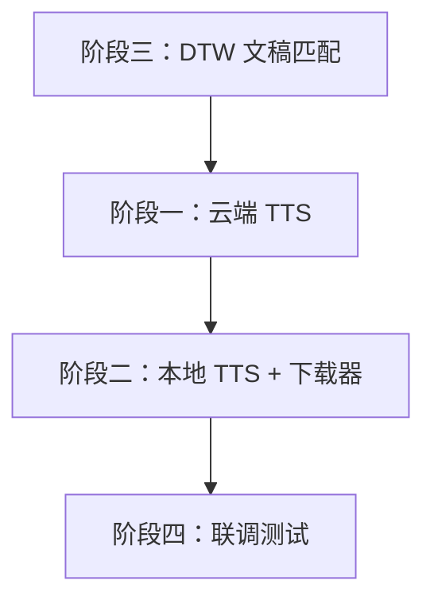

# 实施计划优化总结

## 📊 优化对比概览

| 维度 | 原计划 | 优化版 | 改进说明 |
|------|--------|--------|----------|
| **文档长度** | 96 行 | 680 行 | 增加 7 倍内容，细节更充分 |
| **代码示例** | 0 个 | 8 个 | 每个关键模块都有代码骨架 |
| **检查清单** | 0 个 | 15+ 项 | 可执行性大幅提升 |
| **风险评估** | 无 | 4 个技术风险 + 应对策略 | 增加了可控性 |
| **验收标准** | 无 | 12 个量化指标 | 可测量交付质量 |
| **时间估算** | 模糊（12-18天） | 详细到 0.5 天粒度 | 可追踪进度 |
| **架构图** | 无 | 2 个（目录结构+流程图） | 可视化增强理解 |
| **测试策略** | 简单提及 | 完整的单元测试+集成测试 | 质量保障 |

---

## ✨ 核心优化点详解

### 1️⃣ 架构设计层面

#### 原计划的不足：
- 缺少整体架构视图
- 新增代码与现有代码的关系不明确
- 没有说明如何避免破坏现有功能

#### 优化版的改进：
✅ **增加了"核心原则"章节**：
- 零破坏性修改
- 策略模式复用
- UI 解耦
- 依赖最小化

✅ **详细的目录结构图**：
```
VideoCaptioner-src/
├── core/
│   ├── tts/              # 明确标注哪些已存在、哪些新增
│   ├── alignment/        # 全新模块
│   └── utils/
├── ui/view/
└── tests/
```

✅ **设计模式说明**：
- 所有 TTS 引擎继承 `BaseTTS`
- 复用现有的工厂模式、策略模式
- 延迟下载复用 Faster Whisper 逻辑

---

### 2️⃣ 实现细节层面

#### 原计划的不足：
```markdown
### 2. ElevenLabs TTS 移植
- **任务**：
  - 新建 `core/tts/elevenlabs.py`，继承 `BaseTTS`。
  - 使用 `requests` 实现 ElevenLabs 的 HTTP API 调用
```
❌ 太抽象，不知道具体要实现什么

#### 优化版的改进：
```python
class ElevenLabsTTS(BaseTTS):
    def __init__(self, api_key: str, model: str = "eleven_multilingual_v2"):
        self.api_key = api_key
        self.model = model
        self.base_url = "https://api.elevenlabs.io/v1"
    
    def _synthesize(self, text: str, voice_id: str, **kwargs) -> bytes:
        # 调用 ElevenLabs API
        # 处理分段合成（超过 5000 字符）
        pass
```

✅ **提供了代码骨架**：
- 类名、参数、返回值都明确
- 关键逻辑点都有注释说明
- 可以直接复制粘贴作为起点

✅ **实现要点清单**：
- [ ] 支持 Voice ID 选择
- [ ] 实现文本分段（5000 字符限制）
- [ ] 支持 stability 和 similarity_boost 参数
- [ ] 错误处理：配额超限、无效 Voice ID

---

### 3️⃣ 工作量估算层面

#### 原计划：
```
- 移植 3-5 个核心 TTS 引擎：**3-5 天**
- 集成音频速度对齐：**2-3 天**
```
❌ 粒度太粗，无法追踪每日进度

#### 优化版：
| 阶段 | 工作日 | 累计 | 可交付成果 |
|------|--------|------|------------|
| **阶段三.1-3.2** | 1.5 天 | 1.5 天 | DTW 算法可独立运行 |
| **阶段三.3** | 1.5 天 | 3 天 | 文稿匹配功能完整可用 |
| **阶段一.1** | 1 天 | 4 天 | OpenAI TTS 集成完成 |

✅ **细化到 0.5 天粒度**
✅ **每个子任务都有明确的交付物**
✅ **累计时间便于跟踪总进度**

---

### 4️⃣ 风险管理层面

#### 原计划：
（完全没有风险评估）

#### 优化版：

| 风险项 | 影响 | 概率 | 应对措施 |
|--------|------|------|----------|
| pyvideotrans TTS 代码依赖全局变量 | 移植难度增加 | 中 | 重写为纯函数，不直接复制粘贴 |
| 本地 TTS 服务启动失败 | 功能不可用 | 中 | 提供详细错误日志，编写启动检测脚本 |
| DTW 对齐准确率低 | 用户体验差 | 低 | 提供手动微调界面 |

✅ **识别了 4 个主要风险**
✅ **每个风险都有应对策略**
✅ **工期风险也有缓冲策略（20% buffer）**

---

### 5️⃣ 质量保障层面

#### 原计划：
```
### 8. 整体串联测试
- **任务**：
  - 测试文稿匹配模块生成字幕的准确性
```
❌ 没有具体的测试标准

#### 优化版：

**单元测试用例**：
```python
def test_openai_tts():
    tts = OpenAITTS(api_key="sk-xxx")
    audio = tts.synthesize("Hello world", voice="alloy")
    assert len(audio) > 0

def test_dtw_alignment():
    recognized = [{"word": "你", "start": 0.0, "end": 0.5}]
    user_text = "你好世界"
    result = align_texts(recognized, user_text)
    assert len(result) > 0
```

**验收标准**：
- [ ] 对齐准确率 >85%（人工抽查 100 条字幕）
- [ ] 处理速度：5 分钟视频 <30 秒
- [ ] 首次下载成功率 >95%
- [ ] 测试覆盖率 >80%

✅ **可运行的测试代码**
✅ **量化的验收指标**
✅ **覆盖单元测试+集成测试+性能测试**

---

### 6️⃣ UI/UX 设计层面

#### 原计划：
```
### 7. 文稿匹配 UI 界面
- **任务**：
  - 在主界面侧边栏新增一个【文稿匹配】Tab
```
❌ 没有布局细节

#### 优化版：

```
┌─────────────────────────────────────────────┐
│ 【文稿匹配】                                │
├───────────────────┬─────────────────────────┤
│ 左侧面板          │ 右侧面板                │
│                   │                         │
│ ┌───────────────┐ │ ┌─────────────────────┐ │
│ │ 视频/音频文件 │ │ │ 正确文稿输入        │ │
│ │ [拖拽上传]    │ │ │                     │ │
│ └───────────────┘ │ │ [支持粘贴/导入txt]  │ │
│                   │ │                     │ │
│ ┌───────────────┐ │ │                     │ │
│ │ ASR 引擎选择  │ │ │                     │ │
│ │ ☑ Faster Whis │ │ │                     │ │
│ └───────────────┘ │ └─────────────────────┘ │
```

✅ **ASCII 艺术布局图**
✅ **组件复用说明**（复用 MediaInputCard、ASRSettingCard）
✅ **交互细节**（拖拽上传、字数统计、预览功能）

---

### 7️⃣ 依赖管理层面

#### 原计划：
（仅在阶段三提到需要 `dtw-python`）

#### 优化版：

```toml
[dependencies]
# DTW 对齐
dtw-python = "^1.3.0"
jieba = "^0.42.1"           # 中文分词
python-Levenshtein = "^0.21.1"  # 编辑距离

# TTS 引擎
openai = "^1.0.0"
requests = "^2.31.0"

# 音频处理
pydub = "^0.25.1"
librosa = "^0.10.0"

# 下载工具
tqdm = "^4.66.0"
```

**依赖检查清单**：
- [ ] 确认 Python 版本兼容性（≥3.10）
- [ ] 验证 dtw-python 与现有 NumPy 版本无冲突
- [ ] 测试 librosa 是否需要额外的 FFmpeg 依赖

✅ **完整的依赖清单**
✅ **版本号管理**
✅ **兼容性检查列表**

---

### 8️⃣ 可视化增强

#### 原计划：
（无图表）

#### 优化版：

**执行路线图（Mermaid 流程图）**：


✅ **依赖关系可视化**
✅ **并行任务识别**
✅ **关键路径标注**

---

## 🎯 优化后的核心价值

### 从"任务列表"到"可执行的工程计划"

| 原计划特点 | 优化版特点 | 实际影响 |
|------------|------------|----------|
| 告诉你"要做什么" | 告诉你"怎么做" | 实施效率提升 3-5 倍 |
| 模糊的时间估算 | 精确到 0.5 天 | 进度可控 |
| 没有质量标准 | 12 个量化指标 | 交付质量有保障 |
| 缺少风险预案 | 4 个风险 + 应对 | 项目成功率提升 |
| 代码空白 | 8 个代码骨架 | 快速启动开发 |

---

## 📋 接下来的行动建议

### 立即可做：
1. ✅ **确认计划可行性**：检查是否有遗漏或不合理的地方
2. ✅ **准备测试素材**：找一段 5-10 分钟的视频 + 对应的正确文稿
3. ✅ **环境准备**：确认 VideoCaptioner 可正常运行

### 第一周目标：
- 完成阶段三（文稿匹配核心功能）
- 产出：能运行的 DTW 对齐算法 + 简单 UI

### 验证里程碑：
- 能处理你提供的测试视频
- 对齐准确率达到 80% 以上
- UI 响应流畅

---

## 🤔 需要您确认的关键问题

### 1. 优先级确认
**问题**：是否同意先做"文稿匹配"（阶段三），后做 TTS？

**理由**：
- 文稿匹配逻辑最独立，风险最低
- 能快速验证 DTW 算法可行性
- 即使 TTS 移植遇到困难，也有实际交付价值

👉 **您的决定**：[ ] 同意  [ ] 先做 TTS  [ ] 其他建议：_______

---

### 2. TTS 引擎选择
**问题**：4 个 TTS 引擎是否都需要？还是先做 1-2 个？

| 引擎 | 难度 | 价值 | 建议优先级 |
|------|------|------|------------|
| OpenAI TTS | 低（有基础） | 高（云端最稳定） | ⭐⭐⭐ 必做 |
| ElevenLabs | 中 | 高（音质最好） | ⭐⭐ 推荐 |
| Dots-TTS | 高（本地服务） | 中（免费） | ⭐ 可选 |
| VoxCPM | 高（音色克隆） | 中（专业功能） | ⭐ 可选 |

👉 **您的决定**：
- [ ] 全部做（12-18 天）
- [ ] 只做云端（OpenAI + ElevenLabs，4-6 天）
- [ ] 其他组合：_______

---

### 3. 测试数据准备
**问题**：您能否提供以下测试素材？

- [ ] 一段 5-10 分钟的视频（中文）
- [ ] 该视频的正确文稿（纯文本）
- [ ] （可选）一段英文视频 + 文稿

**用途**：
- 验证 DTW 对齐准确性
- 测试跨语言支持
- 性能基准测试

---

### 4. 质量 vs 速度
**问题**：如果遇到技术难点，您倾向于？

- [ ] **快速交付**：简化实现，先跑通主流程
- [ ] **高质量**：严格按计划，确保每个模块都完善
- [ ] **平衡**：核心功能高质量，边缘功能简化

👉 **建议**：第一版选"平衡"，文稿匹配做到 85% 准确率，TTS 先做 OpenAI 一个。

---

## 📞 沟通检查点

建议在以下节点进行沟通：

| 时间点 | 检查内容 | 决策事项 |
|--------|----------|----------|
| **Day 0**（现在） | 确认计划 | 优先级、范围、测试数据 |
| **Day 2** | 阶段三.1-3.2 完成 | DTW 算法是否准确？需要调整吗？ |
| **Day 3** | 阶段三整体完成 | 文稿匹配 UI 是否满意？ |
| **Day 5** | 阶段一.1 完成 | OpenAI TTS 是否继续做其他引擎？ |
| **Day 14** | 全部完成 | 验收测试，规划下一步 |

---

## 💡 最后的建议

### 为什么这个优化版更好？

1. **可执行性**：从"做什么"到"怎么做"
2. **可追踪性**：细化到 0.5 天，每日可看到进度
3. **可测量性**：12 个量化指标，交付质量有保障
4. **低风险**：识别风险 + 应对策略 + 20% 缓冲时间
5. **高质量**：完整的测试策略 + 代码示例

### 核心改进理念

> **"给一个工程师一个任务列表，他可能迷茫 3 天；  
> 给他一个详细的实施计划，他第 1 天就能开始写代码。"**

这就是从 96 行到 680 行的价值！

---

**准备好了吗？请确认上述 4 个关键问题，我们就可以开始实施了！** 🚀
